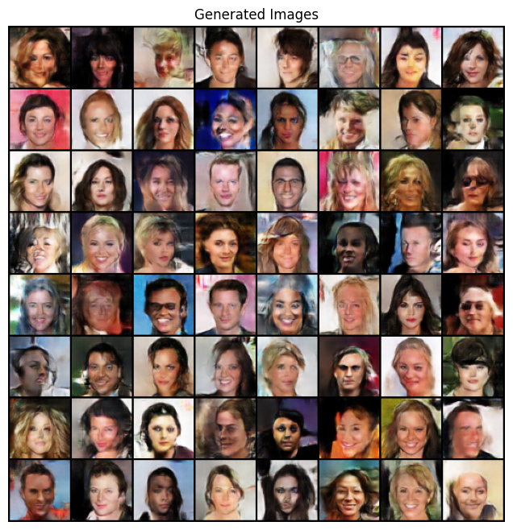

# **DCGAN for Image Generation**  

## **Overview**  
This project implements a **Deep Convolutional Generative Adversarial Network (DCGAN)** to generate synthetic images. The model is trained using the **CelebA dataset** and follows the architecture proposed by **Radford et al. (2015)**.  

## **Dataset Preprocessing**  
The dataset used is **CelebA (Large-scale CelebFaces Attributes Dataset)**, which contains **over 200,000 celebrity face images**.  

### **Steps to preprocess the dataset**  
1. **Download the Dataset**  
   - The dataset is downloaded from **Kaggle** using the `kagglehub` package.  
   - You can also manually download it from [CelebA Kaggle Page](https://www.kaggle.com/jessicali9530/celeba-dataset).  

2. **Apply Transformations**  
   - Resize images to **64x64 pixels** (to match DCGAN input requirements).  
   - Apply **center cropping** to remove unnecessary background.  
   - Convert images to **PyTorch tensors**.  
   - Normalize pixel values to **[-1,1]** (DCGANs perform better with normalized inputs).  

### **Code for Data Preprocessing**  
```python
transform = transforms.Compose([
    transforms.Resize(64),
    transforms.CenterCrop(64),
    transforms.ToTensor(),
    transforms.Normalize((0.5,), (0.5,))
])

dataset = dsets.ImageFolder(root=dataset_path, transform=transform)
dataloader = DataLoader(dataset, batch_size=128, shuffle=True, num_workers=4, pin_memory=True)
```

---

## **How to Train the Model**  
### **Step 1: Install Dependencies**  
Ensure you have the required dependencies installed:  
```bash
pip install torch torchvision numpy matplotlib tqdm kagglehub
```

### **Step 2: Train the Model**  
Run the `DCGAN_final.ipynb` notebook or execute the Python script:  
```bash
python train.py
```
- The model will train for **5 epochs** (you can increase this for better results).  
- Training logs will display **discriminator and generator loss**.  

### **Training Loop Overview**  
1. The **Discriminator (D)** is trained to distinguish real vs. fake images.  
2. The **Generator (G)** is trained to generate realistic images.  
3. The model updates after every batch.  
4. Loss values are printed every **100 iterations**.  

```python
for epoch in range(num_epochs):
    for i, (real_images, _) in enumerate(dataloader):
        ...
        # Train Discriminator
        lossD = lossD_real + lossD_fake
        lossD.backward()
        optimizerD.step()

        # Train Generator
        lossG = criterion(output_gen, labels_gen)
        lossG.backward()
        optimizerG.step()
```

### **Expected Training Logs**  
```
Epoch [1/5] Batch 0/500 
Loss D: 0.654, Loss G: 1.342

Epoch [1/5] Batch 100/500 
Loss D: 0.483, Loss G: 2.345
...
```

---

## **How to Test the Model**  
### **Step 1: Load Trained Generator**  
After training, you can **generate new images** using a fixed noise vector:  
```python
fixed_noise = torch.randn(64, 100, 1, 1, device=device)

with torch.no_grad():
    fake_images = netG(fixed_noise).detach().cpu()
```

### **Step 2: Display Generated Images**  
```python
import matplotlib.pyplot as plt
import torchvision.utils as vutils
import numpy as np

img_grid = vutils.make_grid(fake_images, padding=2, normalize=True)

plt.figure(figsize=(8, 8))
plt.imshow(np.transpose(img_grid, (1, 2, 0)))
plt.axis("off")
plt.title("Generated Images")
plt.show()
```

---

## **Expected Outputs**  
After successful training, the generator should create **realistic-looking images**.  
- **Epoch 1:** Noisy, blurred images.  
- **Epoch 3:** Some facial features become visible.  
- **Epoch 5+:** Clearer and more detailed images.  

### **Example Generated Images**  
  

If training is successful, the generator will produce **high-quality, realistic images** similar to the dataset.  

---

## **Further Improvements**  
1. **Train for more epochs** (at least 25–50 for better results).  
2. **Use a larger dataset** (more diversity helps).  
3. **Increase generator capacity** (more feature maps).  
4. **Experiment with different loss functions** (Wasserstein loss for WGANs).  

---

## **References**  
- **Radford, A., Metz, L., & Chintala, S. (2015).** [Unsupervised Representation Learning with Deep Convolutional Generative Adversarial Networks](https://arxiv.org/abs/1511.06434).  
- **CelebA Dataset:** [Kaggle Dataset](https://www.kaggle.com/jessicali9530/celeba-dataset).  
- **DCGAN PyTorch Guide:** [Official PyTorch DCGAN Tutorial](https://pytorch.org/tutorials/beginner/dcgan_faces_tutorial.html).  

---
